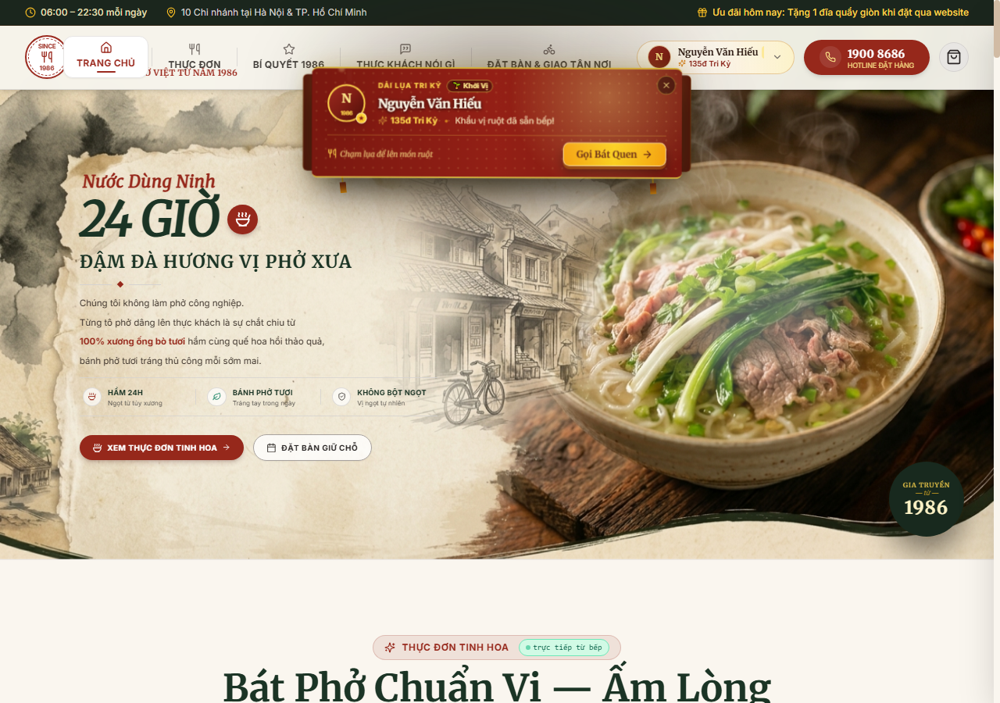
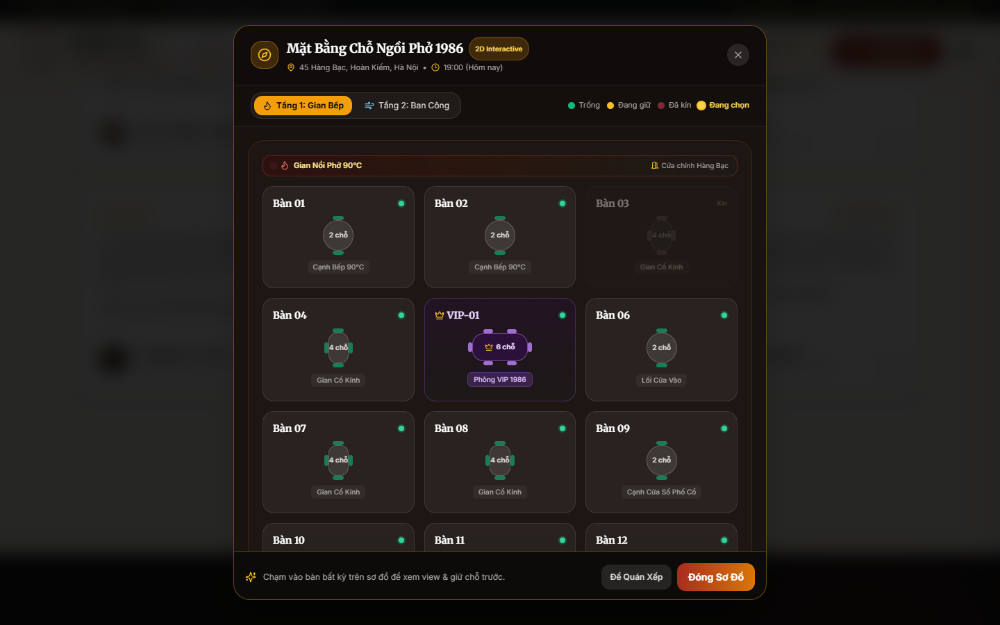
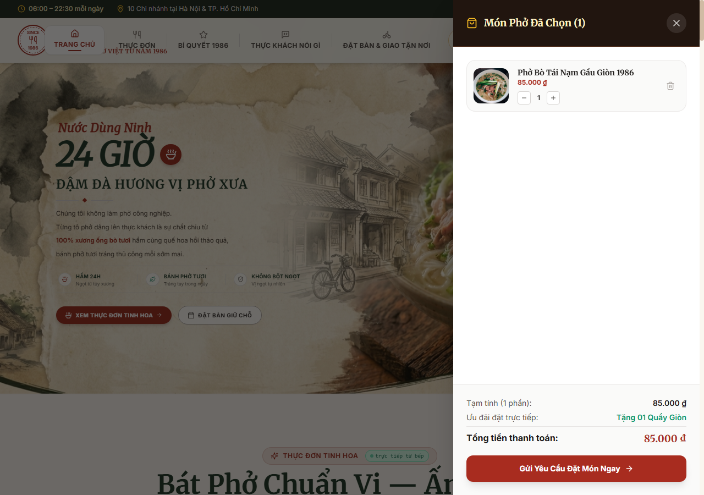
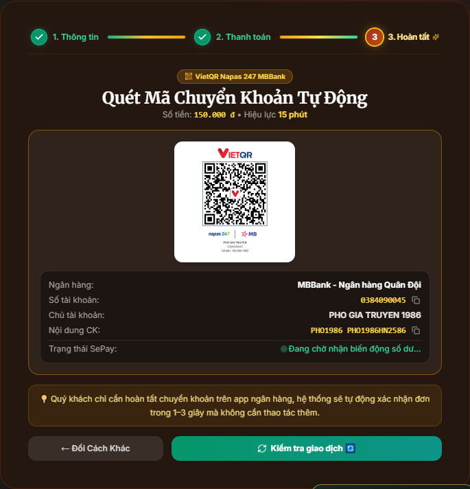
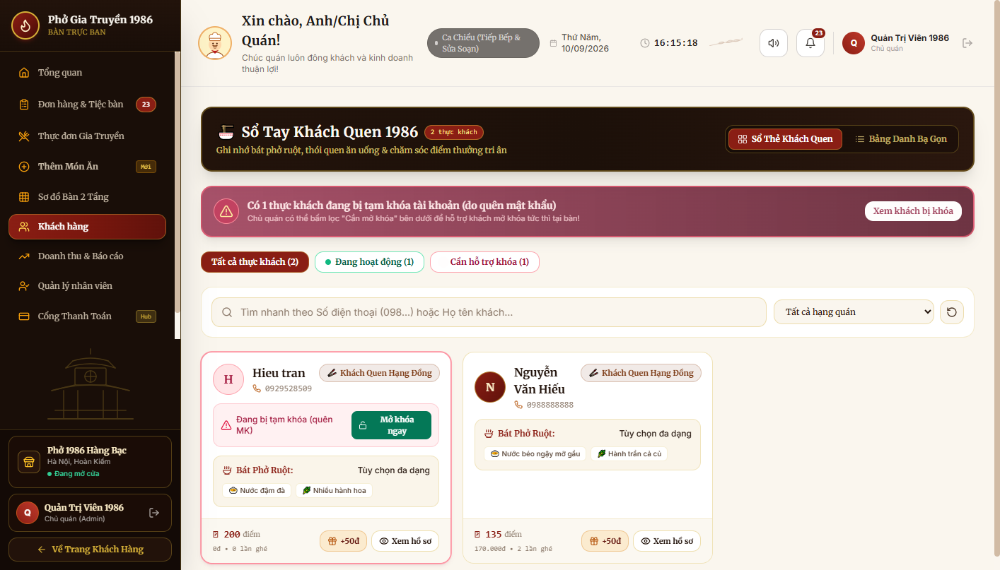
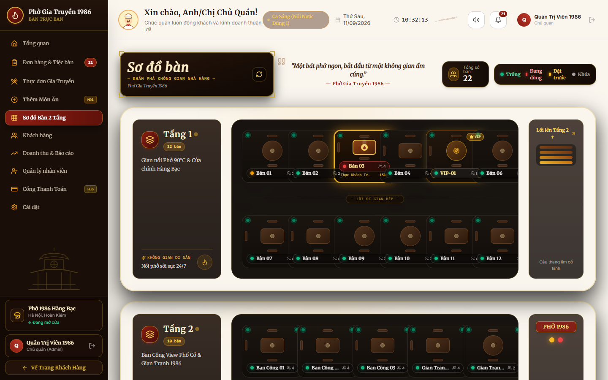
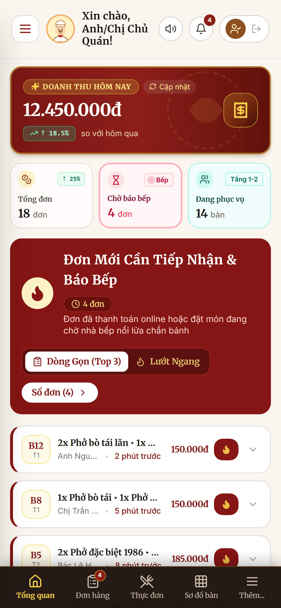

<div align="center">

# 🍜 PHỞ GIA TRUYỀN 1986 — ỨNG DỤNG WEB FRONTEND
### *Nền Tảng Ẩm Thực Số & Trải Nghiệm Đặt Bàn Thời Gian Thực*

<br/>

<p align="center">
  
</p>

<br/>

[](https://react.dev/)
[](https://vitejs.dev/)
[](https://tailwindcss.com/)
[](https://www.framer.com/motion/)
[](https://vietqr.net/)
[](https://web.dev/responsive-web-design-basics/)

<br/>

Ứng dụng Single Page Application (SPA) hiện đại kết hợp thương mại ẩm thực, hỗ trợ đặt bàn 2 tầng theo thời gian thực, tùy biến khẩu vị món ăn, tự động hóa luồng thanh toán chuyển khoản qua webhook ngân hàng và hệ thống hội viên tích điểm tri kỷ.

[Trải Nghiệm Thực Tế](https://pho-gt.vercel.app) • [Tài Liệu REST API](#-kết-nối-rest-api-cốt-lõi) • [Giải Pháp Kiến Trúc](#-thách-thức-kỹ-thuật-trọng-tâm--giải-pháp-kiến-trúc)

</div>

---

## 🌐 TRẢI NGHIỆM THỰC TẾ & TÀI KHOẢN DÙNG THỬ

| Môi trường | Địa chỉ URL | Tài khoản thử nghiệm | Vai trò |
|---|---|---|---|
| **Production Staging** | [`https://pho-gt.vercel.app`](https://pho-gt.vercel.app) | `0987654321` (Mã OTP: `198686`) | Khách hàng |
| **Cổng Quản Trị (Admin)** | [`https://pho-gt.vercel.app/#admin`](https://pho-gt.vercel.app/#admin) | `admin@pho1986.vn` / `admin123` | Quản lý nhà hàng |
| **Môi Trường Local** | [`http://localhost:5173`](http://localhost:5173) | Khởi tạo tự động qua `DataInitializer.java` | Toàn bộ vai trò |

---

## 🧭 HÀNH TRÌNH TRẢI NGHIỆM & PHÂN TÍCH KỸ THUẬT

Ứng dụng điều phối toàn diện vòng đời trải nghiệm ẩm thực của khách hàng qua 6 module kỹ thuật chuyên sâu:

---

### 1. Sơ Đồ Bàn Ăn 2 Tầng Tương Tác & Khóa Giữ Chỗ Tạm Thời
<p align="center">
  
</p>

| Khía cạnh kỹ thuật | Chi tiết hiện thực |
|---|---|
| **Component cốt lõi** | `src/components/SeatMapModal.jsx`, `src/components/seatmap/TableCard.jsx` |
| **Quản lý State & API** | `tableApi.getAllTables()`, cơ chế dynamic polling định kỳ (`3000ms`), cập nhật giao diện lạc quan (optimistic selection) |
| **Bài toán kỹ thuật** | **Chống xung đột đặt bàn đồng thời (Race Condition)**: Ngăn chặn tình trạng 2 khách đặt trùng bàn. Trạng thái bàn tự động chuyển sang `RESERVED` đi kèm khóa TTL 15 phút ngay khi đơn nháp được khởi tạo. |
| **Chiến lược hiển thị** | Bố cục CSS Grid thích ứng linh hoạt cho cả 2 tầng (Tầng 1: Phố cổ nhộn nhịp, Tầng 2: Ban công & Phòng VIP), tối ưu hiển thị mượt mà đến viewport 320px. |

---

### 2. Tùy Biến Khẩu Vị & Ngăn Kéo Giỏ Hàng
<p align="center">
  
</p>

| Khía cạnh kỹ thuật | Chi tiết hiện thực |
|---|---|
| **Component cốt lõi** | `src/components/CartDrawer.jsx`, `src/context/CartContext.jsx` |
| **State & Lưu trữ** | Đồng bộ trạng thái cục bộ vào `localStorage` phân tách theo định danh người dùng: `pho1986_cart_usr_${userId}` |
| **Bài toán kỹ thuật** | **Chính sách chống trục lợi Voucher (Anti-Voucher Abuse)**: Thực thi quy tắc bắt buộc giỏ hàng phải có ít nhất 01 món phở chính mới áp dụng được mã giảm giá, triệt tiêu việc lạm dụng voucher cho nước ngọt hay món phụ. |
| **Tối ưu hiệu năng** | Tính toán tổng giá trị đơn (`totalAmount`, `discountAmount`, `finalAmount`) qua `useMemo`, loại bỏ hoàn toàn các chu kỳ re-render DOM dư thừa. |

---

### 3. Thanh Toán Tự Động Không Chạm VietQR Napas 247 & Đối Soát Chống Gian Lận
<p align="center">
  
</p>

| Khía cạnh kỹ thuật | Chi tiết hiện thực |
|---|---|
| **Component cốt lõi** | `src/components/order/OrderStep3QrPayment.jsx`, `src/components/order/OrderStep3Success.jsx` |
| **Cổng thanh toán** | Sinh mã VietQR động theo chuẩn EMVCo Napas 247 kết hợp xác nhận giao dịch thời gian thực qua Webhook SePay IPN |
| **Bài toán kỹ thuật** | **Tự động chuyển trang không chạm (Zero-Click Transition)**: Tự động Polling endpoint `/api/v1/payments/status/{code}` mỗi 2.5 giây. Ngay khi ngân hàng ghi nhận biến động số dư, giao diện tự động chuyển sang màn hình vé xác nhận mà khách không cần chạm vào màn hình. |
| **Bảo mật & Chống gian lận (Zero-Trust Anti-Fraud)** | **Xác thực đối soát 2 chiều (On-Demand Server Reconciliation)**: Triệt tiêu hoàn toàn rủi ro giả mạo trạng thái ở Client (F12/DevTools). Chức năng "Kiểm tra giao dịch 🔄" kích hoạt truy vấn đối soát trực tiếp với máy chủ; hệ thống chỉ cấp vé và chuyển trạng thái khi giao dịch được xác thực `SUCCESS` từ hệ thống ngân hàng. |

---

### 4. Két Quà Tri Kỷ & Thẻ Hội Viên Tích Điểm
<p align="center">
  
</p>

| Khía cạnh kỹ thuật | Chi tiết hiện thực |
|---|---|
| **Component cốt lõi** | `src/components/loyalty/GiftVaultModal.jsx`, `src/components/loyalty/FlyingRedeemedVoucher.jsx` |
| **Tính toán hạng bậc** | Xác định ngưỡng hạng thành viên đồng bộ với Backend (Đồng, Bạc, Vàng, Kim Cương) |
| **Đồ họa chuyển động** | Framer Motion với quỹ đạo Parabol mô phỏng hiệu ứng voucher bay thẳng vào ví thẻ khách hàng khi đổi quà. |
| **Bảo mật dữ liệu cá nhân** | Số điện thoại và thông tin định danh luôn được che dấu theo chuẩn PII (`098****888`). |

---

### 5. Cổng Quản Trị Sơ Đồ Bàn Ăn Diorama Thời Gian Thực
<p align="center">
  
</p>

| Khía cạnh kỹ thuật | Chi tiết hiện thực |
|---|---|
| **Component cốt lõi** | `src/components/admin/AdminPortal.jsx`, `src/components/admin/tabs/AdminTablesTab.jsx` |
| **Nghiệp vụ vận hành** | Theo dõi trạng thái bàn trực quan, liên kết mã đơn, mở khóa bàn thủ công, chuyển chế độ bảo trì bàn |
| **Phân quyền truy cập** | Tuyến đường được bảo vệ nghiêm ngặt (Protected Route), kiểm tra xác thực quyền `ADMIN` qua Cookie HttpOnly an toàn. |

---

### 6. Thiết Kế Công Thái Học Mobile-First & Thanh Điều Hướng Nhanh
<p align="center">
  
</p>

| Khía cạnh kỹ thuật | Chi tiết hiện thực |
|---|---|
| **Component cốt lõi** | `src/components/menu/MenuQuickNavigator.jsx`, `src/components/navbar/NavbarMobileBottomNav.jsx` |
| **Công thái học** | **Vùng ngón tay cái tự nhiên (Natural Thumb Zone)**: Neo điều khiển tại vị trí trung tâm phía dưới (`bottom-[74px] left-1/2 -translate-x-1/2`), dễ dàng thao tác bằng một tay trên thiết bị di động mà không đè lên thanh điều hướng hoặc bong bóng chat. |
| **Điều hướng mượt mà** | Tính toán bù trừ vị trí neo `#menu-catalog` chống nhảy thanh tiêu đề; tự động căn giữa danh mục đang xem qua ScrollSpy. |

---

## ⚡ THÁCH THỨC KỸ THUẬT TRỌNG TÂM & GIẢI PHÁP KIẾN TRÚC

### 1. Kiến Trúc Lưu Trữ Kép Đảm Bảo Tính Bền Vững Của Phiên (Dual-Storage Session Resilience)
- **Vấn đề**: Khi khách hàng tải lại trang (F5) trong lúc thanh toán hoặc xem vé đặt bàn, các ứng dụng SPA thông thường dễ mất trạng thái tạm, đẩy người dùng quay lại bước ban đầu.
- **Giải pháp**: Xây dựng chiến lược phân vùng dữ liệu 2 tầng:
  - `sessionStorage`: Lưu mã vé và đơn hàng đang xử lý (`pho1986_order_session_${code}`), cho phép khôi phục trạng thái ngay sau khi F5.
  - `localStorage`: Lưu trữ lịch sử đơn hàng dài hạn có định danh theo User ID (`pho1986_customer_order_history_usr_${uid}`) hoặc chế độ khách vãng lai (`_guest`), triệt tiêu việc trùng lặp dữ liệu trên thiết bị dùng chung.

### 2. Tối Ưu Chu Trình Render & Giải Phóng Bộ Nhớ (Render Pipeline & Memory Optimization)
- **Vấn đề**: Danh mục thực đơn với hơn 20 món ăn, các thao tác thêm giỏ hàng và bật tắt món yêu thích diễn ra liên tục dễ kích hoạt re-render toàn bộ cây component.
- **Giải pháp**:
  - Thay thế các phép quét mảng $O(N)$ bằng `Set` tra cứu $O(1)$ (`favoriteIdsSet`, `addedItemIdsSet`).
  - Bao bọc các nhánh component lớn bằng `React.memo` và phân tách logic phức tạp vào các custom hooks độc lập (`useMenuSectionState.js`, `useOrderSectionState.js`, `useGiftVaultState.js`).

### 3. Bảo Mật Truyền Tải Dữ Liệu Theo Chuẩn IETF RFC 6819
- **Vấn đề**: Việc lưu trữ JWT access/refresh token trong `localStorage` khiến phiên đăng nhập dễ bị tấn công đánh cắp qua lỗ hổng Cross-Site Scripting (XSS).
- **Giải pháp**: Toàn bộ token được cô lập trong **HttpOnly + SameSite=Lax Cookies**, ngăn chặn hoàn toàn mã JavaScript phía client (`document.cookie`) tiếp cận dữ liệu phiên.

---

## 🏛️ CẤU TRÚC THƯ MỤC DỰ ÁN

```
frontend/
├── docs/
│   └── screenshots/          # Ảnh chụp màn hình giao diện thực tế độ phân giải cao
├── evidence/                 # Bằng chứng kiểm thử giao diện và telemetry
├── public/                   # Tài nguyên tĩnh, hình ảnh di sản, favicon
├── src/
│   ├── components/
│   │   ├── admin/            # Quản lý sơ đồ bàn diorama, duyệt đơn, CRUD món ăn
│   │   ├── chat/             # Trợ lý ẩm thực ảo ("Tiểu Nhị 1986") với hiệu ứng khói phở
│   │   ├── common/           # Modal công thái học, thông báo toast, skeleton loader
│   │   ├── loyalty/          # Tiến trình tích điểm hạng thẻ, két quà, hiệu ứng voucher
│   │   ├── menu/             # Danh mục món ăn, bảng chi tiết vị phở, MenuQuickNavigator
│   │   ├── navbar/           # Thanh điều hướng trên & thanh dock di động công thái học
│   │   ├── order/            # Quy trình đặt bàn 3 bước, sinh mã thanh toán VietQR
│   │   └── seatmap/          # Modal sơ đồ bàn ăn 2 tầng tương tác thời gian thực
│   ├── context/              # Quản lý trạng thái toàn cục (AuthContext, CartContext)
│   ├── hooks/                # Custom hooks tái sử dụng (useScrollReveal, useAppRouting)
│   ├── services/             # Bộ điều hợp API Axios/Fetch (auth, order, table, payment)
│   └── utils/                # Định dạng tiền tệ VND, che số điện thoại PII, tiện ích bàn
├── index.html
├── package.json
└── vite.config.js
```

---

## 🛠️ HƯỚNG DẪN CÀI ĐẶT & CHẠY THỬ NGHIỆM TẠI LOCAL

### Yêu Cầu Môi Trường
- **Node.js**: Phiên bản `v18.x` hoặc `v20.x+`
- **Trình quản lý gói**: `npm` / `pnpm` / `yarn`
- **Backend Service**: Spring Boot đang hoạt động tại `http://localhost:8080`

### Các Bước Thực Hiện
```bash
# 1. Sao chép mã nguồn kho lưu trữ
git clone git@github.com:HieuTran2901/Pho_GT.git
cd Pho_GT/frontend

# 2. Cài đặt các gói phụ thuộc
npm install

# 3. Khởi động máy chủ phát triển Vite
npm run dev

# 4. Đóng gói bản phát hành tối ưu (Production Build)
npm run build

# 5. Xem trước bản đóng gói
npm run preview
```

Giao diện ứng dụng sẽ sẵn sàng truy cập tại: [`http://localhost:5173`](http://localhost:5173)

---

## 📄 BẢN QUYỀN DỰ ÁN

Phát triển và bảo trì bởi **Hiếu Trần** — Dự án Showcase Năng Lực Kỹ Thuật Phần Mềm.  
Mọi quyền được bảo lưu.
